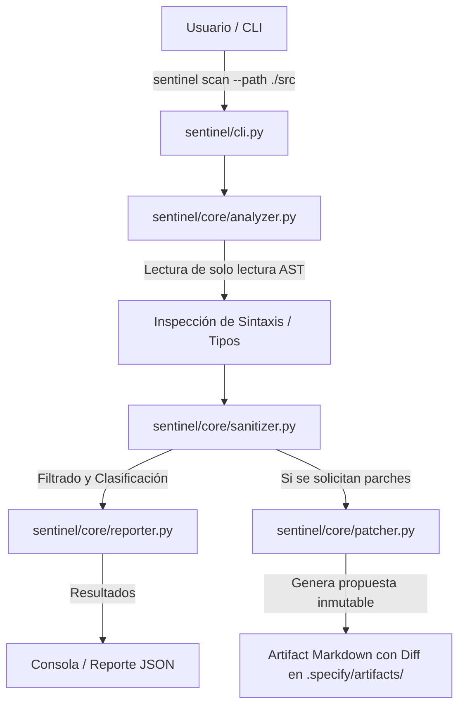

# Plan de Arquitectura e Implementación Técnica: Antigravity Sentinel (`/speckit.plan`)

**Proyecto**: Antigravity Sentinel  
**Stack**: Python 3.11+ | `ast` | `argparse` | `pytest` | `mypy`  
**Arquitectura**: CLI + Módulos de Análisis Estático AST + Generador de Artifacts Zero Trust  

---

## 1. Diseño de Arquitectura de Módulos

```
antigravity_sentinel/
├── pyproject.toml              # Configuración de paquete, mypy y pytest
├── README.md                   # Documentación principal en español
├── sentinel/                   # Paquete principal de Python
│   ├── __init__.py             # Inicializador del paquete y versión
│   ├── cli.py                  # Interfaz de línea de comandos (CLI) con argparse
│   ├── config.py               # Configuración global y constantes de seguridad
│   └── core/                   # Núcleo funcional
│       ├── __init__.py
│       ├── analyzer.py         # Motor de análisis estático basado en AST
│       ├── sanitizer.py        # Módulo de validación de tipos y sanitización OWASP
│       ├── reporter.py         # Formateador de salidas (Consola / JSON)
│       └── patcher.py          # Generador de Artifacts interactivos de parches (Diffs)
└── tests/                      # Suite de pruebas unitarias con pytest
    ├── __init__.py
    ├── test_cli.py             # Pruebas para la interfaz de comandos
    ├── test_analyzer.py        # Pruebas unitarias para el motor AST
    ├── test_sanitizer.py       # Pruebas unitarias de sanitización y esquemas
    └── test_patcher.py         # Pruebas de generación de Artifacts
```

---

## 2. Flujo de Datos y Operación Zero Trust



---

## 3. Componentes Detallados y Responsabilidades

### A. `sentinel/cli.py`
- Punto de entrada ejecutable por consola.
- Subcomandos:
  - `scan`: Analiza un directorio o archivo específico.
  - `audit`: Verifica el cumplimiento de reglas constitutivas y tipado.
  - `patch`: Genera un Artifact interactivo proponiendo solución a las incidencias halladas.

### B. `sentinel/core/analyzer.py`
- Utiliza la librería estándar `ast` para inspeccionar el árbol sintáctico abstracto sin ejecutar el código analizado.
- Detecta:
  - Funciones sin anotación de tipos en firma o retorno.
  - Uso de funciones inseguras (`eval`, `exec`, aperturas de archivos sin `encoding="utf-8"`).
  - Manejo de excepciones vacías o cláusulas `except:` genéricas sin filtrado.

### C. `sentinel/core/sanitizer.py`
- Capa de validación de tipos e inmutabilidad de datos de entrada.
- Garantiza que las rutas proporcionadas permanezcan dentro de los límites del espacio de trabajo.

### D. `sentinel/core/patcher.py`
- Implementa la política Zero Trust: **nunca modifica directamente los archivos fuente**.
- Genera sugerencias en formato Markdown con bloques `diff` legibles, siguiendo el estándar de Artifacts de Antigravity.

---

## 4. Plan de Verificación y Calidad

1. **Tipado Estricto:** Ejecución de `mypy --strict sentinel` asegurando 0 errores.
2. **Suite de Pruebas:** Pruebas automáticas con `pytest --cov=sentinel tests/` con un objetivo de cobertura del > 85%.
3. **Validación CLI:** Verificación del comando ejecutable `python -m sentinel.cli`.

---

## 5. Próximos Pasos (Fase C & D)
1. `/speckit.tasks`: Desglosar este plan en tareas de implementación paso a paso.
2. `/speckit.checklist`: Crear la lista de verificación de calidad.
3. `/speckit.implement`: Ejecutar la programación autónoma de la solución.
